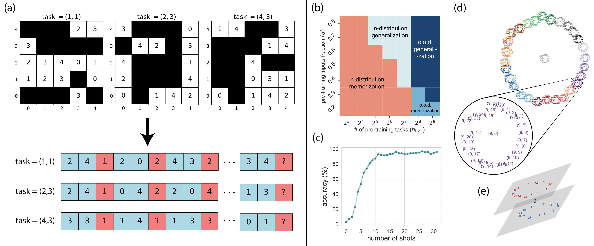
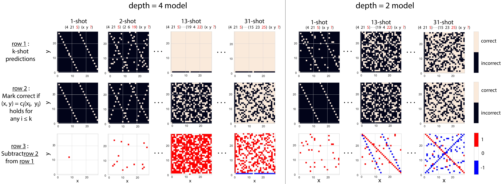

# Learning to grok: Emergence of in-context learning and skill composition in modular arithmetic tasks

This is an official implementation of the paper [arXiv:xxxx.xxxxx].

In this repo we offer scripts for 

- Pretraining
- Making 
- Attention Map and PCA Analysis